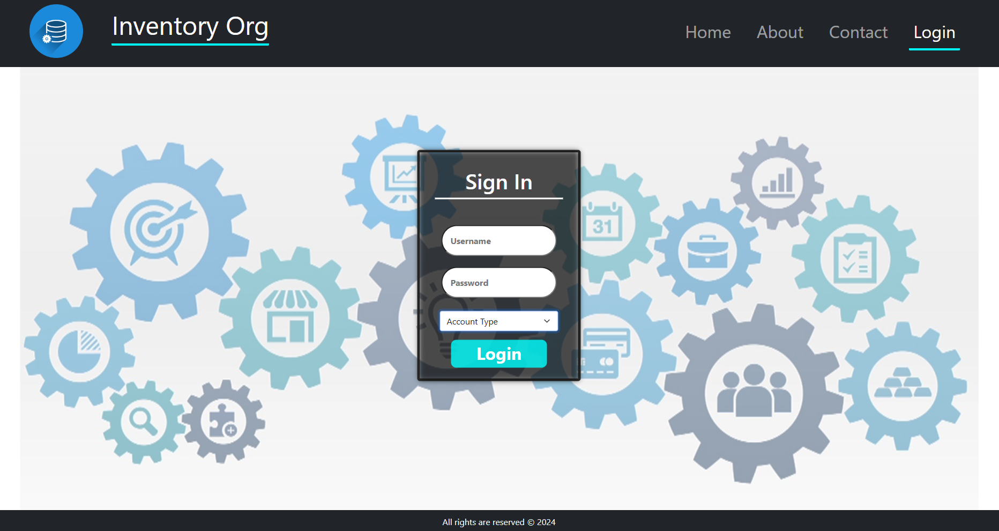

# InventoryOrg - Inventory Management System 
### Click this link to go to live website: [__Demo_Link__](https://samkitsaraf.pythonanywhere.com/)
> Login using below credentials
> * Username : testing
> * Password : justtesting123
> * Account : Staff
## Project Overview
InventoryOrg is a web-based Inventory Management System built with __Django__ and designed to help corporate organizations efficiently manage their assets and employee details. This system provides a centralized database to track and manage product stocks, inward and outward entries, and employee-related information. It allows multiple users to log in simultaneously, ensuring real-time updates and minimizing manual effort in managing inventory records and transactions.


The primary goal of the system is to reduce paperwork, automate manual processes, and provide a more efficient way to manage corporate assets.


## Key Features
* __Employee Management__: Store, view, and update employee information.
* __Inventory Management__: Track all product stocks, issue and return items, and automatically update stock levels.
* __Role-Based Access__: Separate roles for Admin, Manager, and Employee, each with different permissions and functionalities.
* __Reports__: Generate reports for inventory details, inwards entries, outward entries, and returns.
* __Real-time Updates__: Centralized database ensures that changes are reflected immediately for all users.
* __Authentication and Security__: Manage users, provide role-based access, and allow secure login and logout functionality.

## Functional Requirements
* Store employee details.
* Administer user authentication and management (create, view, update, and delete users).
* Manage product stocks (add, update, view stocks).
* Record inwards and outward entries and automatically update stock levels.
* Record stock return entries and track return reasons.
* Generate and download reports for inventory, inward/outward entries, and returns.
* Allow users to update their profiles and change passwords.
* Provide a system to report product issues and track transaction history.
## System Features

### Admin
1. Admin Login
2. Manage user accounts (create, read, update, delete)
3. View employee details and assign assets
4. Track transactions and generate reports
5. Update profile and password

### Manager
1. Manager Login
2. Add and update assets
3. Issue and return items
4. Track assets
5. Update profile and password

### Employee
1. Employee Login
2. Issue and return items
3. Report item issues
4. Track personal transactions
5. Update profile and password

### Technologies Used
* Backend: Django (Python)
* Frontend: HTML, CSS, JavaScript
* Database: SQLite (default), support for PostgreSQL or MySQL
* Version Control: GitHub
* Deployment: (Optional) Heroku or Netlify
# 
# Setup Instructions

### Prerequisites
1. Python 3: Ensure Python 3 is installed on your system. Download Python
2. Virtual Environment: Install virtualenv by running:
```bash
python -m pip install --user virtualenv
```
#### Step 1: Clone the Repository
```bash
git clone https://github.com/samkit09/Inventoryorg.git
cd inventoryorg
```
#### Step 2: Set Up a Virtual Environment
```bash
py -m venv env_name
```
Activate the environment:
```bash
.\env_name\Scripts\activate  # On Windows
source env_name/bin/activate  # On Linux/macOS
```
#### Step 3: Install Dependencies
```bash
pip install -r requirements.txt
```
#### Step 4: Configure Environment Variables
To configure the system, set up the following environment variables:

* DEBUG_VALUE: Either True or False for development and production environments.
* SECRET_KEY: A secret key for hashing URLs and ensuring security.

Generate a random secret key:
```python
from django.core.management.utils import get_random_secret_key
print(get_random_secret_key())
```
> [!NOTE] 
> Alternatively, these variables can be hardcoded in settings.py (not recommended for production).

#### Step 5: Apply Database Migrations
```bash
python manage.py makemigrations
python manage.py migrate
```
#### Step 6: Create a Superuser
Create an admin account to manage the system:
```bash
python manage.py createsuperuser
```
> [!IMPORTANT]
> Enter the required details when prompted, and set account_type = 'AD'

#### Step 7: Run the Development Server
```bash
python manage.py runserver
```
> [!NOTE]
> Access the application via your web browser at http://localhost:8000/ or http://127.0.0.1:8000/
#### Step 8: Login
Log in using the superuser credentials created earlier. Through this account you can create new profiles.

## Usage
Admin can manage employee and asset details, generate reports, and assign roles to users.
Managers can add, update, issue, and return items from the inventory.
Employees can issue and return items and report issues with assets.
All users can update their profiles and passwords securely.
Reporting Issues
If any issues arise related to products or transactions, the user can report the problem through the application interface.

### Fork the repository.
Create a new branch for your feature or bug fix.
Submit a pull request for review.

License
This project is licensed under the MIT License. See the LICENSE file for more details.

### Conclusion
The InventoryOrg application simplifies corporate asset and employee detail management by reducing manual processes and paperwork, providing a centralized platform for tracking assets, managing transactions, and generating reports efficiently. This system not only saves time but also enhances productivity across the organization.